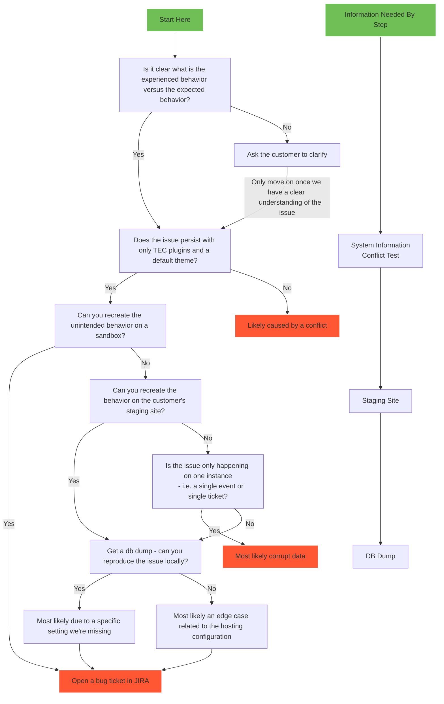

# Support Workflow

```mermaid
graph TD
    A[Start Here]
    A --> B
    B[Is it clear what is the experienced behavior versus the expected behavior?]
    B -->|Yes| C
    B -->|No| D
    C[Does the issue persist with only TEC plugins and a default theme?]
    D[Ask the customer to clarify]
    D -->|Only move on once we have a clear 
    understanding of the issue|C
    C -->|Yes|E
    C -->|No|F
    E[Can you recreate the unintended behavior on a sandbox?]
    F[Likely caused by a conflict]
    E --> |Yes| G
    E --> |No| H
    G[Open a bug ticket in JIRA]
    H[Can you recreate the behavior on the customer's staging site?]
    H -->|Yes| I
    H -->|No| J
    I[Get a db dump - can you reproduce the issue locally?]
    I -->|Yes| N
    I -->|No| M
    M[Most likely an edge case related to the hosting configuration]
    N[Most likely due to a specific setting we're missing]
    M --> G
    N --> G
    J[Is the issue only happening on one instance
    - i.e. a single event or single ticket?]
    J --> |Yes| K
    J --> |No| I
    K[Most likely corrupt data]
    
style A fill:#6FBF56,stroke:#ffffff,stroke-width:2px;
style F fill:#FF5733,stroke:#ffffff,stroke-width:2px;
style K fill:#FF5733,stroke:#ffffff,stroke-width:2px;
style G fill:#FF5733,stroke:#ffffff,stroke-width:2px;

%% Second Graph - Information Gathering
    A2[Information Needed By Step]
    A2 ----> B2
    B2[
        System Information
        Conflict Test
    ]
    B2 ---> C2
    C2[Staging Site]
    C2 ---> D2
    D2[DB Dump]

style A2 fill:#6FBF56,stroke:#ffffff,stroke-width:2px;
```