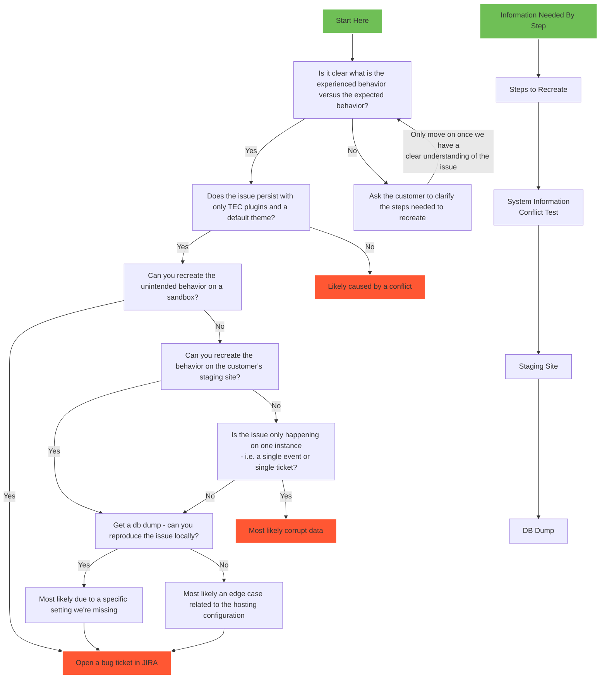

# Support Workflow



## Info Collection

### Steps To Recreate

- If the steps to recreate are unclear, try recording a video of the steps that you are taking to try to recreate and
  ask the customer to record a similar video showcasing any steps you might be missing.
- Once you have the steps, ask them to complete a conflict test - if the issue goes away it is likely a conflict.
- If the issue persists, follow the steps on a fresh WP sandbox - if you can recreate the issue then it is likely a bug
  in our code - open a ticket in JIRA.

### System Info

- Make sure that you check for the site's language (there have been some issues with French sites, specifically).
- Look for Caching plugins - if necessary, have the customer temporarily disable caching and retest.
- Look at which hosting provider they are using - if you suspect it could be a server issue, make sure they have
  everything configured based on our KB for that hosting provider.
- Look for the site's migration status - if the migration is incomplete, even if it is likely unrelated we should offer
  to help get them migrated.
- Even if a customer says they have completed a conflict test, do not fully rule out the possibility until you can test
  yourself.

### Staging Site

- From step 1, you should have a clear understanding of the steps the customer is taking to reproduce the issue; once
  you have access to the staging site complete those steps to see if you can also reproduce.
- Next, eliminate extra factors by disabling all other plugins, switching to a default theme, and trying to reproduce
  the issue again.
- You can match the customer's settings for testing purposes by
  using [this plugin](https://theeventscalendar.com/extensions/settings-import-export/).
    - This can be used if the customer cannot create a staging site for whatever reason.
    - This also could be an alternative option to a db dump.

### DB Dump

- [How to use a database dump](https://www.loom.com/share/471ae3b4fcaf4a7f8df2e67a7feb37a4).
- Once you have the db set up locally, try the steps to reproduce again.
    - If you can reproduce, you now have in depth access to debugging tools to try to narrow down where the root of the
      issue is!
    - If you cannot reproduce, it is more likely to be related to something on the server side of things since that is
      the last variable remaining.

### Edge Case

- If you've made it through the whole workflow and believe that the issue is an edge case that needs developer
  investigation, open a ticket in JIRA with the new Edge Case Template (coming soon).
- Add as much detail as possible, including:
    - Steps to reproduce
    - Troubleshooting steps already taken
    - A TL;DR of where things stand
    - Any Slack conversations that are relevant

## Slack Template

When asking a question in Slack, try out this template (copy and paste into Slack):

:question: TL;DR: [In one sentence, what information are you hoping to get from this question?]

:eyebrow: Expected vs Experienced Behavior: [This is what happens when I try to recreate on a sandbox]
vs [this is what is happening on the client's site]

:pencil: Steps to Reproduce:

```
   1. [i.e. Have these plugins installed]
   2. [Step to reproduce]
   3. [Step to reproduce]
   4. [Link to exactly where to see/inspect the issue]
```

:exclamation: Important
Info: [System Info summarized (i.e. PHP version, migration status, anything specific to the issue worth noting), things you've already ruled out]

:link: Ref: [ZD Link]

## Edge Case Template

<h3> TL;DR: </h3>

> Brief summary of the issue. Keep it to 1-2 sentences.

<h3> Expected Behavior vs. What's Actually Occurring: </h3>

> Demonstration of what normally happens (record video on a fresh WP install).
> 
> Brief summary of what the customer is experiencing (follow same steps as before but wherever you can recreate the issue).
> 

<h3> Steps to Recreate </h3>

> Add steps to recreate in this section. Be as specific as possible, especially if it has been a challenge to recreate. 
> 
> 1. The more details you can add, the better.
> 2. Make sure you are specific about where/how the issue can be seen (include links when possible).
> 
> If you can only recreate with a db dump, make sure to include the file on the ticket.  


<h3> Screencast and/or Screenshots </h3>

> Link to (or add as attachments) brief screencast and/or screenshot(s) reproducing the issue

<h3> Environment(s) and Configuration(s) </h3>

> This is super important to include as much info as possible for an edge case: 
> <ul>
> <li> WordPress Version: </li>
>
> <li> PHP Version: 8.1 </li>
>
> <li>Plugins and Versions: </li>
>
>  - EC vX.X.X 
>  - ET vX.X.X
>  - etc.
>
> </ul>

<h3> Summary of Troubleshooting </h3>

> Brief list/summary of things already ruled out 
> 
> Consider this your handoff info - what does the developer need to know in order to take over in the most efficient way possible? 
> 